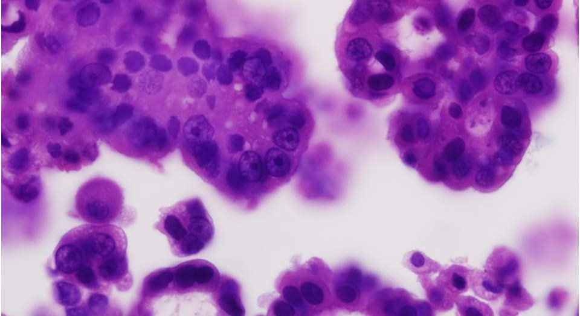
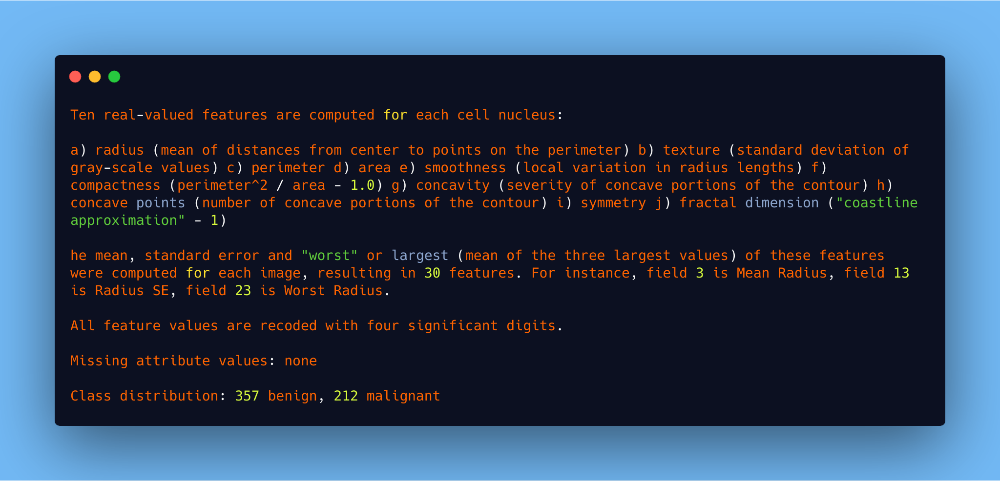

# Breast Cancer Wisconsin (Diagnostic) Prediction
*Predict whether the cancer is benign or malignant*

<a href="#"></a>
<a href="https://github.com/suvhradipghosh07/Breast-Cancer-prediction-using-Machine-Learning-various-Algorithm/blob/master/README.md"></a>

Features are computed from a digitized image of a fine needle aspirate (FNA) of a breast mass. They describe characteristics of the cell nuclei present in the image. n the 3-dimensional space is that described in: [K. P. Bennett and O. L. Mangasarian: "Robust Linear Programming Discrimination of Two Linearly Inseparable Sets", Optimization Methods and Software 1, 1992, 23-34].

This database is also available through the UW CS ftp server: ftp ftp.cs.wisc.edu cd math-prog/cpo-dataset/machine-learn/WDBC/

Also can be found on UCI Machine Learning Repository: https://archive.ics.uci.edu/ml/datasets/Breast+Cancer+Wisconsin+%28Diagnostic%29

In this repository i will trained lots of Machine  learning algorithm from scratch to find which will be the best Algorithm for this dataset.I did bunch of research for analysing this dataset in my main file that is ipython notebook you will see lots of analysis i did using seaborn library in python. seaborn is really a best python library for data visualization.

**Attribute Information:**

*1) ID number 2) Diagnosis (M = malignant, B = benign) 3-32)*

# Observation
<html>
<body>
     
    <b>Here are the results of our Five Algorithm observation</b> 
<table>
  <tr>
    <th>Model</th>
    <th>Algorithm</th>
    <th>Test Accuracy</th>
  </tr>    
  <tr>
    <td>Model 1</td>
    <td>Random Forest Algorithm</td>
    <td>93.15%</td>
  </tr>
  <tr>
    <td>Model 2</td>
    <td>SupportVector Machine Algorithm (SVM)</td>
    <td>91.57%</td>
  </tr>
  <tr>
    <td>Model 3</td>
    <td>Decision Tree Classifier Algorithm</td>
    <td>89.47%</td>
  </tr>
      <tr>
    <td>Model 4</td>
    <td>K-Nearest NeighborsClassifier Algorithm</td>
    <td>93.15%</td>
  </tr>
      <tr>
    <td>Model 5</td>
    <td>GaussianNB Algorithm</td>
    <td>88.42%</td>
  </tr>
  <tr>
        <td>Model 6</td>  
        <td>Logistic regression</td>
        <td>88.42</td>
    
    </tr>
</table>
</body>
</html>
